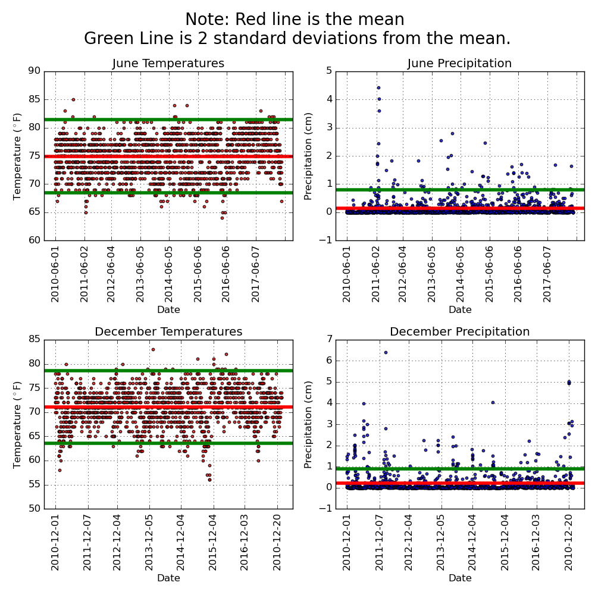

# Surfing Up Ice Cream on Oahu

## Project Overview:

This project focuses on revealing weather trends on the Hawaiian island of Oahu. These data will be used to convince potential investors of the potential of an ice cream and surf shop start up (hypothetical). The investors would like to be convinced that the weather data supports the business model. To add support for this idea using data, exploratory data analysis was conducted using weather staion data. These data contain information of the weather station location, name, precipitation and temperature. Specifically, this project aimed to look at seasonal trends of the temperature and precipitaiton data during the winter month of December and the Summer month of June from 2010 to 2018. Descriptive statistics of the weather from these months will determine the sustainability of this shop year-round. In addition to the statistical analysis, special consideration was paid to understanding the location of weather stations, how this may influence our analysis and further considerations for future planning.

### Resources
#### Software:
- Selected Jupyter core packages...
  - IPython: 8.0.1
  - ipykernel: 6.9.0
  - jupyter_client: 7.1.2
  - jupyter_core: 4.9.1
  - nbclient: 0.5.10
  - notebook: 6.4.8

- SQLAlchemy: 1.4.31
- NumPy: 1.21.5
- Pandas: 1.4.1

- PyGMT
    - version: v0.5.0
    - gmt: 6.3.0

#### Data:
- Weather data : hawaii.sqlite
- Surf Spot data : [Oahu_Surf_Spots.kml](https://www.google.com/maps/d/u/0/embed?mid=1N3iQTTdjIGd3crD9BHkI1vT34zk&ie=UTF8&hl=en&t=h&msa=0&ll=21.614949372270956%2C-158.18949051385036&spn=0.002992%2C0.006105&z=12&output=embed)

## Results:



### Get Descriptive Statistics

```python
# Dependencies
import numpy as np
import pandas as pd
%matplotlib inline
from matplotlib import style
style.use('fivethirtyeight')
import matplotlib.pyplot as plt
import matplotlib.dates as mdates
from matplotlib.dates import DateFormatter

from datetime import datetime, timedelta


# Python SQL toolkit and Object Relational Mapper
import sqlalchemy
from sqlalchemy.ext.automap import automap_base
from sqlalchemy import inspect
from sqlalchemy.orm import Session
from sqlalchemy import create_engine, func
import datetime as dt
```


```python
engine = create_engine("sqlite:///hawaii.sqlite")

# reflect an existing database into a new model
Base = automap_base()
# reflect the tables
Base.prepare(engine, reflect=True)

# Save references to each table
Measurement = Base.classes.measurement
Station = Base.classes.station
```


```python
# Create our session (link) from Python to the DB
session = Session(engine)
```

## D1: Determine the Summary Statistics for June


```python
# 1. Import the sqlalchemy extract function.
from sqlalchemy import extract

# 2. Write a query that filters the Measurement table to retrieve the temperatures for the month of June. 
june_temps = []
june_temps = session.query(Measurement.date, Measurement.tobs).filter(extract('month', Measurement.date)==6).all()

```


```python
#  3. Convert the June temperatures to a list.
june_temps=list(june_temps)
```


```python
# 4. Create a DataFrame from the list of temperatures for the month of June. 
june_temps_df = pd.DataFrame(june_temps, columns=['date','temperature'])
```


```python
june_temps_df
```

<table border="1" class="dataframe">
  <thead>
    <tr style="text-align: right;">
      <th></th>
      <th>date</th>
      <th>temperature</th>
    </tr>
  </thead>
  <tbody>
    <tr>
      <th>0</th>
      <td>2010-06-01</td>
      <td>78.0</td>
    </tr>
    <tr>
      <th>1</th>
      <td>2010-06-02</td>
      <td>76.0</td>
    </tr>
    <tr>
      <th>2</th>
      <td>2010-06-03</td>
      <td>78.0</td>
    </tr>
    <tr>
      <th>3</th>
      <td>2010-06-04</td>
      <td>76.0</td>
    </tr>
    <tr>
      <th>4</th>
      <td>2010-06-05</td>
      <td>77.0</td>
    </tr>
    <tr>
      <th>...</th>
      <td>...</td>
      <td>...</td>
    </tr>
    <tr>
      <th>1695</th>
      <td>2017-06-26</td>
      <td>79.0</td>
    </tr>
    <tr>
      <th>1696</th>
      <td>2017-06-27</td>
      <td>74.0</td>
    </tr>
    <tr>
      <th>1697</th>
      <td>2017-06-28</td>
      <td>74.0</td>
    </tr>
    <tr>
      <th>1698</th>
      <td>2017-06-29</td>
      <td>76.0</td>
    </tr>
    <tr>
      <th>1699</th>
      <td>2017-06-30</td>
      <td>75.0</td>
    </tr>
  </tbody>
</table>
<p>1700 rows × 2 columns</p>
</div>


```python
# 5. Calculate and print out the summary statistics for the June temperature DataFrame.
june_temps_df.describe()
```

<table border="1" class="dataframe">
  <thead>
    <tr style="text-align: right;">
      <th></th>
      <th>temperature</th>
    </tr>
  </thead>
  <tbody>
    <tr>
      <th>count</th>
      <td>1700.000000</td>
    </tr>
    <tr>
      <th>mean</th>
      <td>74.944118</td>
    </tr>
    <tr>
      <th>std</th>
      <td>3.257417</td>
    </tr>
    <tr>
      <th>min</th>
      <td>64.000000</td>
    </tr>
    <tr>
      <th>25%</th>
      <td>73.000000</td>
    </tr>
    <tr>
      <th>50%</th>
      <td>75.000000</td>
    </tr>
    <tr>
      <th>75%</th>
      <td>77.000000</td>
    </tr>
    <tr>
      <th>max</th>
      <td>85.000000</td>
    </tr>
  </tbody>
</table>
</div>


## D2: Determine the Summary Statistics for December


```python
# 6. Write a query that filters the Measurement table to retrieve the temperatures for the month of December.
dec_temps = []
dec_temps = session.query(Measurement.date, Measurement.tobs).filter(extract('month', Measurement.date)==12).all()
```


```python
# 7. Convert the December temperatures to a list.
dec_temps=list(dec_temps)
```


```python
# 8. Create a DataFrame from the list of temperatures for the month of December. 
dec_temps_df = pd.DataFrame(dec_temps, columns=['date','temperature'])
dec_temps_df
```
<table border="1" class="dataframe">
  <thead>
    <tr style="text-align: right;">
      <th></th>
      <th>date</th>
      <th>temperature</th>
    </tr>
  </thead>
  <tbody>
    <tr>
      <th>0</th>
      <td>2010-12-01</td>
      <td>76.0</td>
    </tr>
    <tr>
      <th>1</th>
      <td>2010-12-03</td>
      <td>74.0</td>
    </tr>
    <tr>
      <th>2</th>
      <td>2010-12-04</td>
      <td>74.0</td>
    </tr>
    <tr>
      <th>3</th>
      <td>2010-12-06</td>
      <td>64.0</td>
    </tr>
    <tr>
      <th>4</th>
      <td>2010-12-07</td>
      <td>64.0</td>
    </tr>
    <tr>
      <th>...</th>
      <td>...</td>
      <td>...</td>
    </tr>
    <tr>
      <th>1512</th>
      <td>2016-12-27</td>
      <td>71.0</td>
    </tr>
    <tr>
      <th>1513</th>
      <td>2016-12-28</td>
      <td>71.0</td>
    </tr>
    <tr>
      <th>1514</th>
      <td>2016-12-29</td>
      <td>69.0</td>
    </tr>
    <tr>
      <th>1515</th>
      <td>2016-12-30</td>
      <td>65.0</td>
    </tr>
    <tr>
      <th>1516</th>
      <td>2016-12-31</td>
      <td>65.0</td>
    </tr>
  </tbody>
</table>
<p>1517 rows × 2 columns</p>
</div>


```python
# 9. Calculate and print out the summary statistics for the Decemeber temperature DataFrame.
dec_temps_df.describe()
```

<table border="1" class="dataframe">
  <thead>
    <tr style="text-align: right;">
      <th></th>
      <th>temperature</th>
    </tr>
  </thead>
  <tbody>
    <tr>
      <th>count</th>
      <td>1517.000000</td>
    </tr>
    <tr>
      <th>mean</th>
      <td>71.041529</td>
    </tr>
    <tr>
      <th>std</th>
      <td>3.745920</td>
    </tr>
    <tr>
      <th>min</th>
      <td>56.000000</td>
    </tr>
    <tr>
      <th>25%</th>
      <td>69.000000</td>
    </tr>
    <tr>
      <th>50%</th>
      <td>71.000000</td>
    </tr>
    <tr>
      <th>75%</th>
      <td>74.000000</td>
    </tr>
    <tr>
      <th>max</th>
      <td>83.000000</td>
    </tr>
  </tbody>
</table>
</div>

### Conclusions based on temperature data:
1. 


## Summary:

### Additional queries to take a look at the precipitation data and use summary statistics to gain a better understanding

```python
#Get precipiation data for the month of June, make a datafram and grab summary statistics
june_prcp = []
june_prcp = session.query(Measurement.date, Measurement.prcp).filter(extract('month', Measurement.date)==6).all()
june_prcp_df = pd.DataFrame(june_prcp, columns=['date','Precipitation'])
june_prcp_df.describe()
```

<table border="1" class="dataframe">
  <thead>
    <tr style="text-align: right;">
      <th></th>
      <th>Precipitation</th>
    </tr>
  </thead>
  <tbody>
    <tr>
      <th>count</th>
      <td>1574.000000</td>
    </tr>
    <tr>
      <th>mean</th>
      <td>0.136360</td>
    </tr>
    <tr>
      <th>std</th>
      <td>0.335731</td>
    </tr>
    <tr>
      <th>min</th>
      <td>0.000000</td>
    </tr>
    <tr>
      <th>25%</th>
      <td>0.000000</td>
    </tr>
    <tr>
      <th>50%</th>
      <td>0.020000</td>
    </tr>
    <tr>
      <th>75%</th>
      <td>0.120000</td>
    </tr>
    <tr>
      <th>max</th>
      <td>4.430000</td>
    </tr>
  </tbody>
</table>
</div>


```python
#Get precipiation data for the month of December, make a datafram and grab summary statistics
dec_prcp = []
dec_prcp = session.query(Measurement.date, Measurement.prcp).filter(extract('month', Measurement.date)==12).all()
dec_prcp_df = pd.DataFrame(dec_prcp, columns=['date','Precipitation'])
dec_prcp_df.describe()
```

<table border="1" class="dataframe">
  <thead>
    <tr style="text-align: right;">
      <th></th>
      <th>Precipitation</th>
    </tr>
  </thead>
  <tbody>
    <tr>
      <th>count</th>
      <td>1405.000000</td>
    </tr>
    <tr>
      <th>mean</th>
      <td>0.216819</td>
    </tr>
    <tr>
      <th>std</th>
      <td>0.541399</td>
    </tr>
    <tr>
      <th>min</th>
      <td>0.000000</td>
    </tr>
    <tr>
      <th>25%</th>
      <td>0.000000</td>
    </tr>
    <tr>
      <th>50%</th>
      <td>0.030000</td>
    </tr>
    <tr>
      <th>75%</th>
      <td>0.150000</td>
    </tr>
    <tr>
      <th>max</th>
      <td>6.420000</td>
    </tr>
  </tbody>
</table>
</div>

### Make a map showing the elevation of Oahu, the locations of popular surf spots, and the locations of the weather stations

```python
import geopandas as gpd
import pygmt
import fiona
import re
import pandas as pd
import numpy as np
import datetime as dt
# Python SQL toolkit and Object Relational Mapper
import sqlalchemy
from sqlalchemy import inspect
from sqlalchemy.ext.automap import automap_base
from sqlalchemy.orm import Session
from sqlalchemy import create_engine, func
```


```python
kml = 'Oahu_Surf_Spots.kml'
```


```python
gpd.io.file.fiona.drvsupport.supported_drivers['KML'] = 'rw'
oahu_surf_spots_df = gpd.read_file(kml, driver='KML')
```


```python
oahu_surf_spots_df
```

<table border="1" class="dataframe">
  <thead>
    <tr style="text-align: right;">
      <th></th>
      <th>Name</th>
      <th>Description</th>
      <th>geometry</th>
    </tr>
  </thead>
  <tbody>
    <tr>
      <th>0</th>
      <td>Browns</td>
      <td></td>
      <td>POINT Z (-157.79818 21.25440 0.00000)</td>
    </tr>
    <tr>
      <th>1</th>
      <td>Diamond Head Cliffs</td>
      <td></td>
      <td>POINT Z (-157.80529 21.25288 0.00000)</td>
    </tr>
    <tr>
      <th>2</th>
      <td>Beach Access and Paddle out for DiamondHead Cl...</td>
      <td></td>
      <td>LINESTRING Z (-157.80806 21.25571 0.00000, -15...</td>
    </tr>
    <tr>
      <th>3</th>
      <td>Lighthouse</td>
      <td>Intermediate/ Expert shortboard spot. Fast hol...</td>
      <td>POINT Z (-157.80796 21.25194 0.00000)</td>
    </tr>
    <tr>
      <th>4</th>
      <td>Tongs</td>
      <td></td>
      <td>POINT Z (-157.82091 21.25687 0.00000)</td>
    </tr>
    <tr>
      <th>...</th>
      <td>...</td>
      <td>...</td>
      <td>...</td>
    </tr>
    <tr>
      <th>141</th>
      <td>Ewa Beach Park</td>
      <td></td>
      <td>POINT Z (-157.99090 21.31180 0.00000)</td>
    </tr>
    <tr>
      <th>142</th>
      <td>Lots</td>
      <td></td>
      <td>POINT Z (-157.99496 21.31123 0.00000)</td>
    </tr>
    <tr>
      <th>143</th>
      <td>Diamond Head Cliffs</td>
      <td></td>
      <td>POINT Z (-157.80409 21.25304 0.00000)</td>
    </tr>
    <tr>
      <th>144</th>
      <td>Suicides</td>
      <td></td>
      <td>POINT Z (-157.81885 21.25440 0.00000)</td>
    </tr>
    <tr>
      <th>145</th>
      <td>Graveyards</td>
      <td></td>
      <td>POINT Z (-157.82005 21.25623 0.00000)</td>
    </tr>
  </tbody>
</table>
<p>146 rows × 3 columns</p>
</div>

```python
os_points = oahu_surf_spots_df[oahu_surf_spots_df.geometry.geom_type == 'Point']
os_points
```
<table border="1" class="dataframe">
  <thead>
    <tr style="text-align: right;">
      <th></th>
      <th>Name</th>
      <th>Description</th>
      <th>geometry</th>
    </tr>
  </thead>
  <tbody>
    <tr>
      <th>0</th>
      <td>Browns</td>
      <td></td>
      <td>POINT Z (-157.79818 21.25440 0.00000)</td>
    </tr>
    <tr>
      <th>1</th>
      <td>Diamond Head Cliffs</td>
      <td></td>
      <td>POINT Z (-157.80529 21.25288 0.00000)</td>
    </tr>
    <tr>
      <th>3</th>
      <td>Lighthouse</td>
      <td>Intermediate/ Expert shortboard spot. Fast hol...</td>
      <td>POINT Z (-157.80796 21.25194 0.00000)</td>
    </tr>
    <tr>
      <th>4</th>
      <td>Tongs</td>
      <td></td>
      <td>POINT Z (-157.82091 21.25687 0.00000)</td>
    </tr>
    <tr>
      <th>6</th>
      <td>Rice Bowl</td>
      <td></td>
      <td>POINT Z (-157.82367 21.25696 0.00000)</td>
    </tr>
    <tr>
      <th>...</th>
      <td>...</td>
      <td>...</td>
      <td>...</td>
    </tr>
    <tr>
      <th>141</th>
      <td>Ewa Beach Park</td>
      <td></td>
      <td>POINT Z (-157.99090 21.31180 0.00000)</td>
    </tr>
    <tr>
      <th>142</th>
      <td>Lots</td>
      <td></td>
      <td>POINT Z (-157.99496 21.31123 0.00000)</td>
    </tr>
    <tr>
      <th>143</th>
      <td>Diamond Head Cliffs</td>
      <td></td>
      <td>POINT Z (-157.80409 21.25304 0.00000)</td>
    </tr>
    <tr>
      <th>144</th>
      <td>Suicides</td>
      <td></td>
      <td>POINT Z (-157.81885 21.25440 0.00000)</td>
    </tr>
    <tr>
      <th>145</th>
      <td>Graveyards</td>
      <td></td>
      <td>POINT Z (-157.82005 21.25623 0.00000)</td>
    </tr>
  </tbody>
</table>
<p>108 rows × 3 columns</p>
</div>


### Work on Weather Station Data


```python
engine = create_engine("sqlite:///hawaii.sqlite")

# reflect an existing database into a new model
Base = automap_base()

# reflect the tables
Base.prepare(engine, reflect=True)
Measurement = Base.classes.measurement
Station = Base.classes.station
session = Session(engine)
```


```python
measurement_data=session.query(Measurement.id, Measurement.station, Measurement.date, Measurement.prcp, Measurement.tobs)
measurement_df=pd.DataFrame(measurement_data)
measurement_df
```

<table border="1" class="dataframe">
  <thead>
    <tr style="text-align: right;">
      <th></th>
      <th>id</th>
      <th>station</th>
      <th>date</th>
      <th>prcp</th>
      <th>tobs</th>
    </tr>
  </thead>
  <tbody>
    <tr>
      <th>0</th>
      <td>1</td>
      <td>USC00519397</td>
      <td>2010-01-01</td>
      <td>0.08</td>
      <td>65.0</td>
    </tr>
    <tr>
      <th>1</th>
      <td>2</td>
      <td>USC00519397</td>
      <td>2010-01-02</td>
      <td>0.00</td>
      <td>63.0</td>
    </tr>
    <tr>
      <th>2</th>
      <td>3</td>
      <td>USC00519397</td>
      <td>2010-01-03</td>
      <td>0.00</td>
      <td>74.0</td>
    </tr>
    <tr>
      <th>3</th>
      <td>4</td>
      <td>USC00519397</td>
      <td>2010-01-04</td>
      <td>0.00</td>
      <td>76.0</td>
    </tr>
    <tr>
      <th>4</th>
      <td>5</td>
      <td>USC00519397</td>
      <td>2010-01-06</td>
      <td>NaN</td>
      <td>73.0</td>
    </tr>
    <tr>
      <th>...</th>
      <td>...</td>
      <td>...</td>
      <td>...</td>
      <td>...</td>
      <td>...</td>
    </tr>
    <tr>
      <th>19545</th>
      <td>19546</td>
      <td>USC00516128</td>
      <td>2017-08-19</td>
      <td>0.09</td>
      <td>71.0</td>
    </tr>
    <tr>
      <th>19546</th>
      <td>19547</td>
      <td>USC00516128</td>
      <td>2017-08-20</td>
      <td>NaN</td>
      <td>78.0</td>
    </tr>
    <tr>
      <th>19547</th>
      <td>19548</td>
      <td>USC00516128</td>
      <td>2017-08-21</td>
      <td>0.56</td>
      <td>76.0</td>
    </tr>
    <tr>
      <th>19548</th>
      <td>19549</td>
      <td>USC00516128</td>
      <td>2017-08-22</td>
      <td>0.50</td>
      <td>76.0</td>
    </tr>
    <tr>
      <th>19549</th>
      <td>19550</td>
      <td>USC00516128</td>
      <td>2017-08-23</td>
      <td>0.45</td>
      <td>76.0</td>
    </tr>
  </tbody>
</table>
<p>19550 rows × 5 columns</p>
</div>


```python
stations_data = session.query(Station.id,
                                  Station.station,
                                  Station.name,
                                  Station.longitude,
                                  Station.latitude,
                                  Station.elevation
                                  ).all()
stations_df=pd.DataFrame(stations_data)
stations_df
```
<table border="1" class="dataframe">
  <thead>
    <tr style="text-align: right;">
      <th></th>
      <th>id</th>
      <th>station</th>
      <th>name</th>
      <th>longitude</th>
      <th>latitude</th>
      <th>elevation</th>
    </tr>
  </thead>
  <tbody>
    <tr>
      <th>0</th>
      <td>1</td>
      <td>USC00519397</td>
      <td>WAIKIKI 717.2, HI US</td>
      <td>-157.81680</td>
      <td>21.27160</td>
      <td>3.0</td>
    </tr>
    <tr>
      <th>1</th>
      <td>2</td>
      <td>USC00513117</td>
      <td>KANEOHE 838.1, HI US</td>
      <td>-157.80150</td>
      <td>21.42340</td>
      <td>14.6</td>
    </tr>
    <tr>
      <th>2</th>
      <td>3</td>
      <td>USC00514830</td>
      <td>KUALOA RANCH HEADQUARTERS 886.9, HI US</td>
      <td>-157.83740</td>
      <td>21.52130</td>
      <td>7.0</td>
    </tr>
    <tr>
      <th>3</th>
      <td>4</td>
      <td>USC00517948</td>
      <td>PEARL CITY, HI US</td>
      <td>-157.97510</td>
      <td>21.39340</td>
      <td>11.9</td>
    </tr>
    <tr>
      <th>4</th>
      <td>5</td>
      <td>USC00518838</td>
      <td>UPPER WAHIAWA 874.3, HI US</td>
      <td>-158.01110</td>
      <td>21.49920</td>
      <td>306.6</td>
    </tr>
    <tr>
      <th>5</th>
      <td>6</td>
      <td>USC00519523</td>
      <td>WAIMANALO EXPERIMENTAL FARM, HI US</td>
      <td>-157.71139</td>
      <td>21.33556</td>
      <td>19.5</td>
    </tr>
    <tr>
      <th>6</th>
      <td>7</td>
      <td>USC00519281</td>
      <td>WAIHEE 837.5, HI US</td>
      <td>-157.84889</td>
      <td>21.45167</td>
      <td>32.9</td>
    </tr>
    <tr>
      <th>7</th>
      <td>8</td>
      <td>USC00511918</td>
      <td>HONOLULU OBSERVATORY 702.2, HI US</td>
      <td>-157.99920</td>
      <td>21.31520</td>
      <td>0.9</td>
    </tr>
    <tr>
      <th>8</th>
      <td>9</td>
      <td>USC00516128</td>
      <td>MANOA LYON ARBO 785.2, HI US</td>
      <td>-157.80250</td>
      <td>21.33310</td>
      <td>152.4</td>
    </tr>
  </tbody>
</table>
</div>

## Make some Maps


```python
fig = pygmt.Figure()

#Define The lat long region around Oahu
region = [-158.3, -157.6, 21.2, 21.75]  # xmin, xmax, ymin, ymax

# Load sample grid (3 arc second global relief) in target area
grid = pygmt.datasets.load_earth_relief(resolution="03s", region=region)

#MOST LIKELY WILL NOT USE BUT USEFUL
# Can be plotted alone as a "Hillshade"
# calculate the reflection of a light source projecting from west to east
# (azimuth of 270 degrees) and at a latitude of 30 degrees from the horizon
# Try replacing this grid in the grdimage for the grid argument to see what it looks like
dgrid = pygmt.grdgradient(grid=grid, radiance=[270, 30])

#Define the color map to be used for plotting the 
#elevation model and elevation bounds 0f -3000 bsl m and 1000m asl
pygmt.makecpt(cmap="globe", series=[-3000, 1000])

#plot the elevation grid and 
fig.grdimage(
    grid=grid, 
    projection="M12c", 
    region=region, 
    frame="a",
    shading="+d"
            )

#Illustrate the color bar to show the color representation of the elevation
fig.colorbar(
    #Define the postion to the right of the map and make it a vertical colorbar
    position="JMR+o0.5c/0c+w5c",
    #Ticks every 500 m and annotate every 1km, add a label for elevation
    frame=["a1000f500", "x+lElevation", "y+lm"]
)

#Plot the locations derived from the xml surf locations file
fig.plot(
    data=os_points.geometry, 
    style="c0.1c", 
    color="black", 
    label="Popular_Surf_Spots",
    pen="1p"
)

#Plot the locations of the weather stations
fig.plot(
    x=stations_df.longitude, 
    y=stations_df.latitude, 
    style="c0.5c", 
    color="red", 
    label="Weather_Stations",
    pen="1p"
)

#Plots the labels wo we know which station is which
fig.text(
    text=stations_df.station, 
    x=stations_df.longitude, 
    y=stations_df.latitude, 
    fill="white", 
    angle=30,
    justify="BL"
)

#Add a legend to show the two different symbols we use for surf locations and weather stations
fig.legend() 

fig.show()
```

